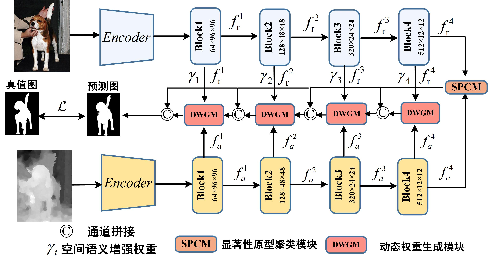

# 原型动态加权的多模态显著性目标检测


The overall architecture.
## Environment
### Requirements
#### Linux with Python ≥ 3.8
#### CUDA 11
#### The provided environment is suggested for reproducing our results, similar configurations may also work.
### Quick Start
```
    conda create -n Spnet python=3.9.1
    conda activate Spnet
    git clone git@github.com:ZZ2490/PDW-SOD.git
    python train_rgbd.py
```
